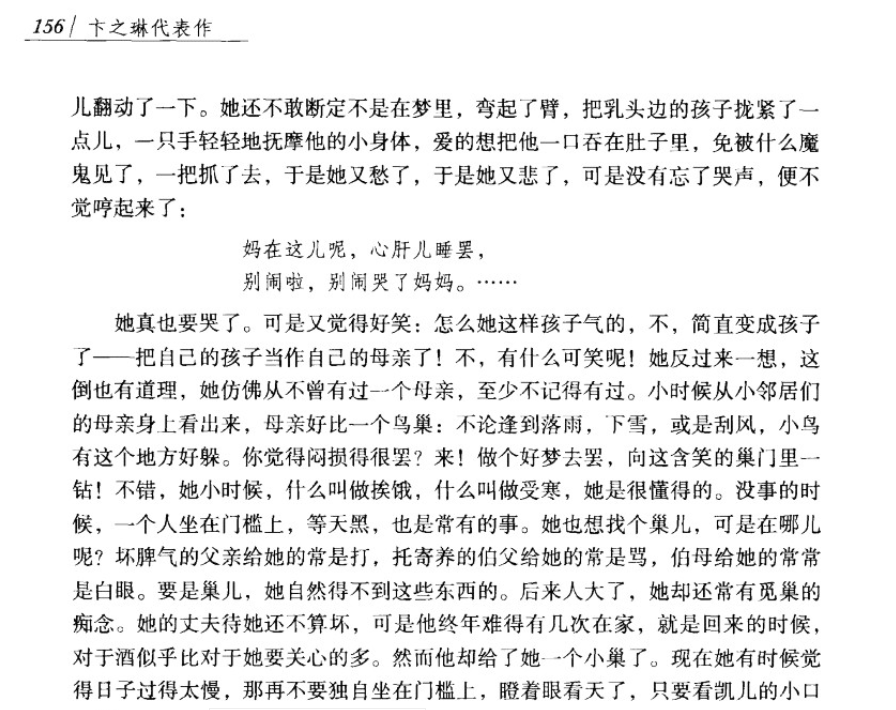
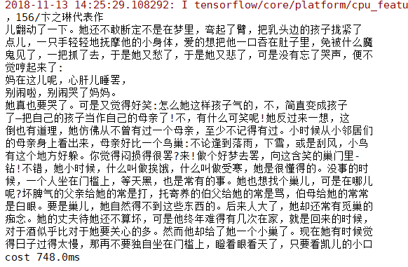
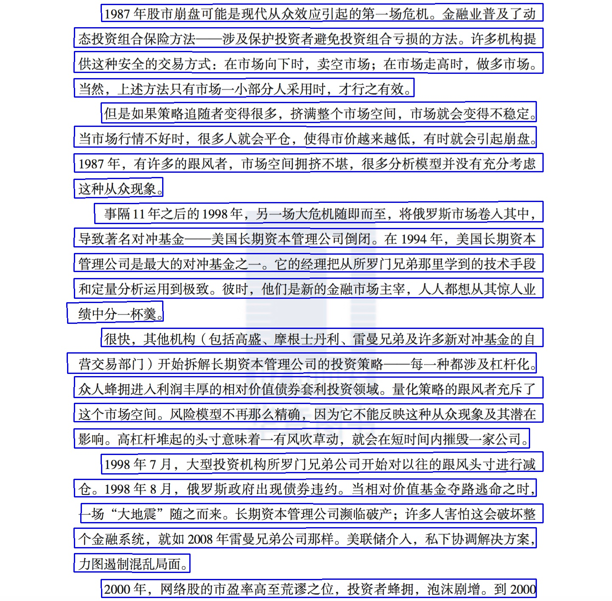
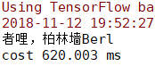

# text-detection

## 简介

为了能将一张图像中的多行文本识别出来，可以将该任务分为两步：

1. 检测图像中每一行文本的位置
2. 根据位置从原始图像截取出一堆子图像
3. 只需识别出子图像的文字，再进行排序组合即可

因此，采用两类模型：

1. 文本检测：CTPN
2. 文本识别：Densenet + ctc

## 安装

### 运行环境

OS: win10
Python: 3.6

### 安装步骤

1. 安装tensorflow 1.9.0，若电脑配置了gpu环境，请选择gpu版，否则选择cpu版

  ```sh
  pip install tensorflow==1.9.0 # 1. for cpu
  pip install tensorflow-gpu==1.9.0 # 2.  for gpu
  ```

2. 安装该包

  ```python
  python setup.py sdist
  cd dist/
  pip install dlocr-0.1.tar.gz
  ```

## 执行速度

| 图像大小 | 处理器    | 文本行数量 | 速度  |
| -------- | --------- | ---------- | ----- |
| 500kb    | 1070ti    | 20         | 420ms |
| 500kb    | Tesla k80 | 20         | 1s    |

## 使用

### OCR

用于识别一张图片中的文字

- 编程方式

  ```python
  import time
  import dlocr

  if __name__ == '__main__':
      ocr = dlocr.get_or_create()
      start = time.time()

      bboxes, texts = ocr.detect("../asset/demo_ctpn.png")
      print('\n'.join(texts))
      print(f"cost: {(time.time() - start) * 1000}ms")
  ```

  `get_or_create()` 支持以下参数用于使用自己训练的模型：

  - ctpn_weight_path
  - ctpn_config_path
  - densenet_weight_path
  - densenet_config_path
  - dict_path

   参数说明：见以下命令行方式中的参数说明。

- 命令行方式

  ```sh
  > python -m dlocr -h

  usage: text_detection_app.py [-h] [--image_path IMAGE_PATH]
                              [--dict_file_path DICT_FILE_PATH]
                              [--densenet_config_path DENSENET_CONFIG_PATH]
                              [--ctpn_config_path CTPN_CONFIG_PATH]
                              [--ctpn_weight_path CTPN_WEIGHT_PATH]
                              [--densenet_weight_path DENSENET_WEIGHT_PATH]
                              [--adjust ADJUST]

  optional arguments:
    -h, --help            show this help message and exit
    --image_path IMAGE_PATH
                          图像位置
    --dict_file_path DICT_FILE_PATH
                          字典文件位置
    --densenet_config_path DENSENET_CONFIG_PATH
                          densenet模型配置文件位置
    --ctpn_config_path CTPN_CONFIG_PATH
                          ctpn模型配置文件位置
    --ctpn_weight_path CTPN_WEIGHT_PATH
                          ctpn模型权重文件位置
    --densenet_weight_path DENSENET_WEIGHT_PATH
                          densenet模型权重文件位置
    --adjust ADJUST       是否对倾斜的文本进行旋转

  ```

1. ctpn模型权重文件位置不指定默认使用`weights/weights-ctpnlstm-init.hdf5`
2. ctpn模型配置文件位置不指定默认使用`config/ctpn-default.json`
3. densenet模型权重文件位置不指定默认使用`weights/weights-densent-init.hdf5`
4. densenet模型配置文件位置不指定默认使用`config/densent-default.json`
5. 字典文件位置不指定默认使用`dictionary/char_std_5990.txt`

示例：

```sh
python -m dlocr  --image_path asset/demo_ctpn.png
```
<div>
    
    
</div>

### CTPN

用于定于图像中文字的位置

- 编程方式

  ```python
  from dlocr import ctpn

  if __name__ == '__main__':
      ctpn = ctpn.get_or_create()
      ctpn.predict("asset/demo_ctpn.png", "asset/demo_ctpn_labeled.jpg")
  ```

- 命令行方式

  ```sh
  > python dlocr.ctpn_predict.py -h

  usage: ctpn_predict.py [-h] [--image_path IMAGE_PATH]
                        [--config_file_path CONFIG_FILE_PATH]
                        [--weights_file_path WEIGHTS_FILE_PATH]
                        [--output_file_path OUTPUT_FILE_PATH]

  optional arguments:
    -h, --help            show this help message and exit
    --image_path IMAGE_PATH
                          图像位置
    --config_file_path CONFIG_FILE_PATH
                          模型配置文件位置
    --weights_file_path WEIGHTS_FILE_PATH
                          模型权重文件位置
    --output_file_path OUTPUT_FILE_PATH
                          标记文件保存位置
  ```

  1. 权重文件位置不指定默认使用`weights/weights-ctpnlstm-init.hdf5`
  2. 配置文件位置不指定默认使用`config/ctpn-default.json`

  示例：

  ```sh
  python ctpn_predict.py --image_path asset/demo_ctpn.png --output_file_path asset/demo_ctpn_labeled.jpg
  ```

  <div>
      
      
  </div>

### Densenet

用于识别固定图像高度中的文字，默认图像高度为32

- 编程方式

  ```python
  from dlocr.densenet import load_dict, default_dict_path
  from dlocr import densenet

  if __name__ == '__main__':
      densenet = densenet.get_or_create()
      text, img = densenet.predict("asset/demo_densenet.jpg", load_dict(default_dict_path))
      print(text)
  ```

- 命令行方式

  ```sh
  > python dlocr.densenet_predict.py -h

  usage: densenetocr_predict.py [-h] [--image_path IMAGE_PATH]
                                [--dict_file_path DICT_FILE_PATH]
                                [--config_file_path CONFIG_FILE_PATH]
                                [--weights_file_path WEIGHTS_FILE_PATH]

  optional arguments:
    -h, --help            show this help message and exit
    --image_path IMAGE_PATH
                          图像位置
    --dict_file_path DICT_FILE_PATH
                          字典文件位置
    --config_file_path CONFIG_FILE_PATH
                          模型配置文件位置
    --weights_file_path WEIGHTS_FILE_PATH
                          模型权重文件位置
  ```

1. 权重文件位置不指定默认使用`weights/weights-densent-init.hdf5`
2. 配置文件位置不指定默认使用`config/densent-default.json`
3. 字典文件位置不指定默认使用`dictionary/char_std_5990.txt`

示例：

```sh
python densenetocr_predict.py --image_path asset/demo_densenet.jpg
```

<div>
    
    
</div>


## 训练

### 数据集说明

- CTPN 训练使用的数据集格式与VOC数据集格式相同，目录格式如下：

    ```json
    - VOCdevkit
        - VOC2007
            - Annotations
            - ImageSets
            - JPEGImages
    ```

- Densenet + ctc 使用的数据集分为3部分

  - 文字图像
  - 标注文件：包括图像路径与所对应的文本标记（train.txt, test.txt)
  - 字典文件：包含数据集中的所有文字 (char_std_5990.txt)

数据集链接：

- ctpn: https://pan.baidu.com/s/1kUNTl1l#list/path=%2F
- densenet: 链接: https://pan.baidu.com/s/1LT9whsTJx-S48rtRTXw5VA 提取码: rugb

关于创建自己的文本识别数据集，可参考：[https://github.com/Sanster/text_renderer](https://github.com/Sanster/text_renderer)。

### CTPN 训练

```sh
> python -m dlocr.ctpn_train -h

usage: ctpn_train.py [-h] [-ie INITIAL_EPOCH] [--epochs EPOCHS] [--gpus GPUS]
                     [--images_dir IMAGES_DIR] [--anno_dir ANNO_DIR]
                     [--config_file_path CONFIG_FILE_PATH]
                     [--weights_file_path WEIGHTS_FILE_PATH]
                     [--save_weights_file_path SAVE_WEIGHTS_FILE_PATH]

optional arguments:
  -h, --help            show this help message and exit
  -ie INITIAL_EPOCH, --initial_epoch INITIAL_EPOCH
                        初始迭代数
  --epochs EPOCHS       迭代数
  --gpus GPUS           gpu的数量
  --images_dir IMAGES_DIR
                        图像位置
  --anno_dir ANNO_DIR   标注文件位置
  --config_file_path CONFIG_FILE_PATH
                        模型配置文件位置
  --weights_file_path WEIGHTS_FILE_PATH
                        模型初始权重文件位置
  --save_weights_file_path SAVE_WEIGHTS_FILE_PATH
                        保存模型训练权重文件位置
```

ctpn 的训练需要传入2个必要参数：

1. 图像目录位置
2. 标注文件目录位置

<模型配置文件位置> 用于指定模型的一些参数，若不指定，将使用默认配置：

```json
{
  "image_channels": 3,  // 图像通道数
  "vgg_trainable": true, // vgg 模型是否可训练
  "lr": 1e-05   // 初始学习率
}
```

<保存模型训练权重文件位置> 若不指定，会保存到当前目录下的model文件夹

训练情况：

```sh
...

Epoch 17/20
6000/6000 [==============================] - 4036s 673ms/step - loss: 0.0895 - rpn_class_loss: 0.0360 - rpn_regress_loss: 0.0534
Epoch 18/20
6000/6000 [==============================] - 4075s 679ms/step - loss: 0.0857 - rpn_class_loss: 0.0341 - rpn_regress_loss: 0.0516
Epoch 19/20
6000/6000 [==============================] - 4035s 673ms/step - loss: 0.0822 - rpn_class_loss: 0.0324 - rpn_regress_loss: 0.0498
Epoch 20/20
6000/6000 [==============================] - 4165s 694ms/step - loss: 0.0792 - rpn_class_loss: 0.0308 - rpn_regress_loss: 0.0484

```

### Densenet 训练

```sh
> python -m dlocr.densenet_train -h
usage: densenet_train.py [-h] [-ie INITIAL_EPOCH] [-bs BATCH_SIZE]
                         [--epochs EPOCHS] [--gpus GPUS]
                         [--images_dir IMAGES_DIR]
                         [--dict_file_path DICT_FILE_PATH]
                         [--train_file_path TRAIN_FILE_PATH]
                         [--test_file_path TEST_FILE_PATH]
                         [--config_file_path CONFIG_FILE_PATH]
                         [--weights_file_path WEIGHTS_FILE_PATH]
                         [--save_weights_file_path SAVE_WEIGHTS_FILE_PATH]

optional arguments:
  -h, --help            show this help message and exit
  -ie INITIAL_EPOCH, --initial_epoch INITIAL_EPOCH
                        初始迭代数
  -bs BATCH_SIZE, --batch_size BATCH_SIZE
                        小批量处理大小
  --epochs EPOCHS       迭代数
  --gpus GPUS           gpu的数量
  --images_dir IMAGES_DIR
                        图像位置
  --dict_file_path DICT_FILE_PATH
                        字典文件位置
  --train_file_path TRAIN_FILE_PATH
                        训练文件位置
  --test_file_path TEST_FILE_PATH
                        测试文件位置
  --config_file_path CONFIG_FILE_PATH
                        模型配置文件位置
  --weights_file_path WEIGHTS_FILE_PATH
                        模型初始权重文件位置
  --save_weights_file_path SAVE_WEIGHTS_FILE_PATH
                        保存模型训练权重文件位置
```

Densnet 的训练需要4个必要参数：

1. 训练图像位置
2. 字典文件位置
3. 训练文件位置
4. 测试文件位置

<模型配置文件位置> 用于指定模型使用的配置文件路径，若不指定，默认配置如下：

```json
{
  "lr": 0.0005, // 初始学习率
  "num_classes": 5990, // 字典大小
  "image_height": 32,   // 图像高
  "image_channels": 1,  // 图像通道数
  "maxlen": 50,         // 最长文本长度
  "dropout_rate": 0.2,  //  随机失活率
  "weight_decay": 0.0001, // 权重衰减率
  "filters": 64         // 模型第一层的核数量
}
```

<保存模型训练权重文件位置> 若不指定，会保存到当前目录下的model文件夹

训练情况：

```sh
Epoch 3/100
25621/25621 [==============================] - 15856s 619ms/step - loss: 0.1035 - acc: 0.9816 - val_loss: 0.1060 - val_acc: 0.9823
Epoch 4/100
25621/25621 [==============================] - 15651s 611ms/step - loss: 0.0798 - acc: 0.9879 - val_loss: 0.0848 - val_acc: 0.9878
Epoch 5/100
25621/25621 [==============================] - 16510s 644ms/step - loss: 0.0732 - acc: 0.9889 - val_loss: 0.0815 - val_acc: 0.9881
Epoch 6/100
25621/25621 [==============================] - 15621s 610ms/step - loss: 0.0691 - acc: 0.9895 - val_loss: 0.0791 - val_acc: 0.9886
Epoch 7/100
25621/25621 [==============================] - 15782s 616ms/step - loss: 0.0666 - acc: 0.9899 - val_loss: 0.0787 - val_acc: 0.9887
Epoch 8/100
25621/25621 [==============================] - 15560s 607ms/step - loss: 0.0645 - acc: 0.9903 - val_loss: 0.0771 - val_acc: 0.9888
```

## 其它

### 训练好的权重文件

链接: https://pan.baidu.com/s/1HaeLO-fV_WCtTZl4DQvrzw 提取码: ihdx

### 参考

1. https://github.com/YCG09/chinese_ocr
2. https://github.com/xiaomaxiao/keras_ocr
